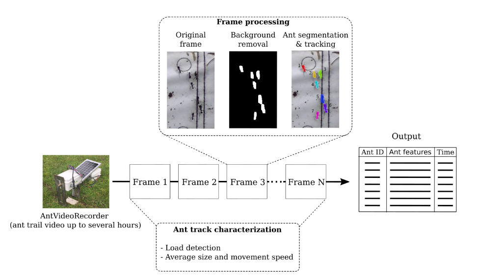

# AntTracker



AntTracker is a software to analyze the foraging behavior of leaf-cutter ants from videos. A device such as the [AntVRecord](https://www.sciencedirect.com/science/article/pii/S2468067222000153) should be used on the nest path. The software will detect each ant trajectory and their load, and extract behaviour features.

We also provide a video labeling utility, the AntLabeler, which was used to validate the results obtained by AntTracker on test videos. This tool can be used along with the AntTracker to provide an assisted, semi-supervised way to label crowded videos in a fraction of the time.

This software was developed by Francisco Sturniolo ([original repository](https://github.com/fd-sturniolo/AntTracker)). This repository contains the  source code used in the work "AntTracker: A low-cost and efficient computer vision approach to research leaf-cutter ants behavior", J. Sabattini , F. Sturniolo, M. Bollazzi andd L. Bugnon (under review)

## Installation

The basic requirements are

- `git`
- `conda` (Miniconda or Anaconda)
- [`MakeNSIS`](https://nsis.sourceforge.io/Download) 

To configure the environment, run the script `create-env.ps1`.

The project is composed by a module `ant_tracker` with three submodules:

- `labeler`
- `tracker`
- `tracker_gui`

```powershell
git clone "https://github.com/lbugnon/AntTracker.git"
cd AntTracker
.\create-env ENV_NAME
conda activate ENV_NAME
.\build                     
MakeNSIS make_installer.nsi 
```